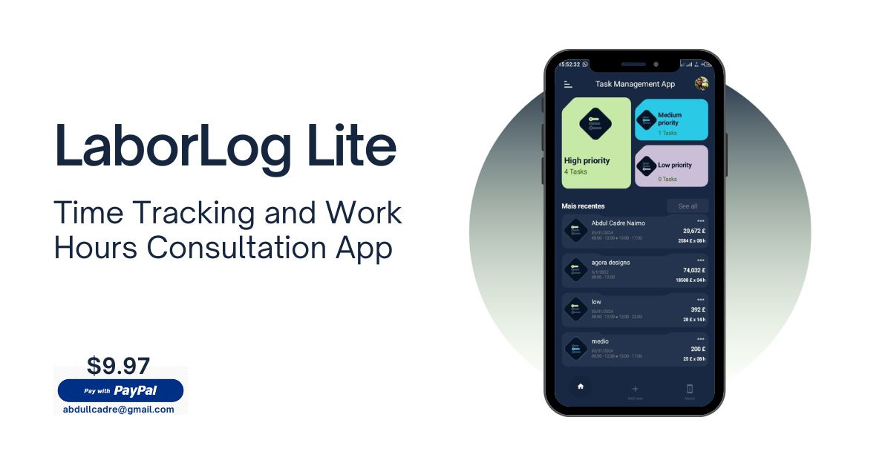

### App Description

LaborLog Lite is an Android application developed using the B4XPage framework. This application is designed to facilitate the registration and consultation of working hours and duration, as well as the automatic calculation of the number of hours worked. With a simple and modern interface, LaborLog Lite provides an organized experience for users to efficiently manage their working time.

### Features

1. **Time Entry and Exit Logging:**
   - Users can log daily entry and exit times.
   - The system automatically calculates the total hours worked.

2. **Task Priority:**
   - Each task can be assigned one of three priority levels: high, medium, or low.

3. **SQLite Database:**
   - Utilizes an SQLite database to efficiently store user data.

4. **User Management:**
   - Users can create an account and log in to access their personalized tasks.

5. **Profile Editing:**
   - Users have the ability to edit their profiles to keep information up-to-date.

6. **Report Generation:**
   - Generates PDF reports for each individual task and consolidated monthly and annual reports.

### B4X Description

B4X is an event-driven programming language used to develop applications for various platforms, including Android. B4XPage is a specific component of B4X that simplifies the creation of user interfaces.

### App Execution

To run LaborLog Lite, follow these steps:

1. Clone this repository.
2. Open the project in the B4X IDE.
3. Compile and run the code on your Android device.

### App Features Priority Order

1. Time Entry and Exit Logging
2. Task Priority
3. SQLite Database
4. User Management
5. Profile Editing
6. Report Generation

---
